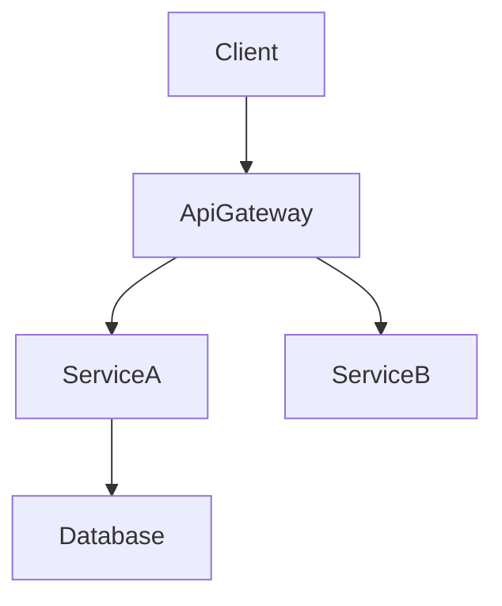

# 技術設計のルールと原則

## コア設計原則

### 1. 型安全性は必須
- TypeScriptインターフェースで`any`型を**絶対に使用しない**
- すべてのパラメータと戻り値に明示的な型を定義する
- エラーハンドリングには判別可能なユニオン型を使用する
- ジェネリクスの制約を明確に指定する

### 2. 設計 vs 実装
- **HOWではなくWHATに焦点を当てる**
- コードではなくインターフェースとコントラクトを定義する
- 事前条件/事後条件を通じて振る舞いを指定する
- アルゴリズムではなくアーキテクチャ上の決定を文書化する

### 3. ビジュアルコミュニケーション
- **シンプルな機能**: 基本的なコンポーネント図またはなし
- **中程度の複雑さ**: アーキテクチャ + データフロー
- **高い複雑さ**: 複数の図（アーキテクチャ、シーケンス、状態）
- **常にプレーンなMermaid**: スタイリングなし、構造のみ

### 4. コンポーネント設計ルール
- **単一責任**: コンポーネントごとに1つの明確な目的
- **明確な境界**: 明示的なドメインオーナーシップ
- **依存関係の方向**: アーキテクチャ層に従う
- **インターフェース分離**: 最小限の焦点を絞ったインターフェース
- **チームセーフなインターフェース**: マージコンフリクトなしに並列実装を可能にする境界を設計する
- **リサーチトレーサビリティ**: 境界の決定と根拠を`research.md`に記録する

### 5. データモデリング標準
- **ドメイン優先**: ビジネス概念から始める
- **一貫性境界**: 明確な集約ルート
- **正規化**: パフォーマンスと整合性のバランス
- **進化**: スキーマ変更の計画

### 6. エラーハンドリング哲学
- **早期失敗**: 早期かつ明確に検証する
- **グレースフルデグラデーション**: 完全な失敗よりも部分的な機能
- **ユーザーコンテキスト**: 実行可能なエラーメッセージ
- **可観測性**: 包括的なロギングとモニタリング

### 7. 統合パターン
- **疎結合**: 依存関係を最小化する
- **コントラクト優先**: 実装前にインターフェースを定義する
- **バージョニング**: API進化の計画
- **冪等性**: リトライセーフな設計
- **コントラクトの可視性**: APIとイベントコントラクトをdesign.mdに表面化し、`research.md`からの詳細へリンクする

## ドキュメント標準

### 言語とトーン
- **宣言的**: 「システムはユーザーを認証すべき」ではなく「システムはユーザーを認証する」
- **正確**: 曖昧な説明より具体的な技術用語
- **簡潔**: 必要不可欠な情報のみ
- **フォーマル**: プロフェッショナルな技術文書

### 構造要件
- **階層的**: 明確なセクション構成
- **追跡可能**: 要件からコンポーネントへのマッピング
- **完全**: 実装に必要なすべての側面をカバー
- **一貫性**: 全体を通じて統一された用語
- **焦点を絞る**: design.mdはアーキテクチャとコントラクトに集中し、調査ログや長い比較は`research.md`に移動する

## セクション執筆ガイダンス

### グローバル順序
- デフォルトのフロー: 概要 → 目標/非目標 → 要件トレーサビリティ → アーキテクチャ → 技術スタック → システムフロー → コンポーネントとインターフェース → データモデル → オプションセクション
- チームは、明確性が向上する場合、トレーサビリティを前に移動したり、データモデルをアーキテクチャの近くに配置したりできるが、セクション見出しは維持する
- 各セクション内では、**サマリー → スコープ → 決定 → 影響/リスク**のフローに従い、レビュアーが一貫してスキャンできるようにする

### 要件ID
- 要件は接頭辞なしで`2.1, 2.3`として参照する（「要件2.1」は使用しない）
- すべての要件には数値IDが必須。要件に数値IDがない場合は、続行する前に`requirements.md`を停止して修正する
- `N.M`形式の数値IDを使用する。Nはrequirements.mdのトップレベル要件番号（例: 要件1 → 1.1, 1.2; 要件2 → 2.1, 2.2）
- すべてのコンポーネント、タスク、およびトレーサビリティ行は同じ正規の数値IDを参照する必要がある

### 技術スタック
- この機能に影響を受けるレイヤーのみを含める（フロントエンド、バックエンド、データ、メッセージング、インフラ）
- 各レイヤーにツール/ライブラリ + バージョン + 機能での役割を指定する。詳細な根拠、比較、またはベンチマークは`research.md`に移動する
- 既存システムを拡張する場合、現在のスタックからの逸脱を強調し、新しい依存関係をリストする

### システムフロー
- 非自明なフローを明確にする場合にのみ図を追加する:
  - **シーケンス**: 複数ステップのインタラクション
  - **プロセス/状態**: 分岐ルールまたはライフサイクル
  - **データ/イベント**: パイプラインまたは非同期パターン
- 常にプレーンなMermaidを使用する。複雑なフローが存在しない場合は、セクション全体を省略する
> 図の後に各ステップを再述するのではなく、フローレベルの決定（例: ゲート条件、リトライ）を簡潔に説明する

### 要件トレーサビリティ
- 要件が複数のドメインにまたがる複雑な機能やコンプライアンス重要な機能には、標準テーブル（`要件 | 概要 | コンポーネント | インターフェース | フロー`）を使用してカバレッジを証明する
- 単一の要件がコンポーネントに1:1でマッピングされる場合のみ箇条書き形式に省略する
- シンプルなマッピングにはコンポーネントサマリーテーブルを優先し、複雑またはコンプライアンス重要な要件には完全なトレーサビリティテーブルを使用する
- 要件またはコンポーネントが変更されるたびにこのマッピングを再実行し、ドリフトを避ける

### コンポーネントとインターフェース作成
- コンポーネントをドメイン/レイヤーでグループ化し、コンポーネントごとに1つのブロックを提供する
- コンポーネント、ドメイン、意図、要件カバレッジ、主要な依存関係、選択されたコントラクトをリストするサマリーテーブルから始める
- テーブルフィールド: 意図（1行）、要件（`2.1, 2.3`）、オーナー/レビュアー（オプション）
- 依存関係テーブルは各エントリをインバウンド/アウトバウンド/外部としてマークし、重要度（`P0`ブロッキング、`P1`高リスク、`P2`情報提供）を割り当てる必要がある
- 外部依存関係調査のサマリーはここに残す。詳細な調査（APIシグネチャ、レート制限、マイグレーションノート）は`research.md`に記載する
- design.mdは自己完結型のレビュアーアーティファクトでなければならない。背景のためにのみ`research.md`を参照し、結論や決定はここに再述する
- コントラクト: 関連するタイプのみチェックする（Service/API/Event/Batch/State）。チェックされていないタイプは後のコンポーネントセクションに表示されるべきではない
- サービスインターフェースはメソッドシグネチャ、入力/出力、およびエラーエンベロープを宣言する必要がある。API/Event/Batchコントラクトには、トリガー、ペイロード、配信、冪等性をカバーするスキーマテーブルまたは箇条書きリストが必要
- **統合とマイグレーションノート**、**検証フック**、**オープンクエスチョン/リスク**を使用して、ロールアウト戦略、可観測性、未解決の決定を文書化する
- 詳細密度ルール:
  - **フルブロック**: 新しい境界を導入するコンポーネント（ロジックフック、共有サービス、外部統合、データレイヤー）
  - **サマリーのみ**: 新しい境界のないプレゼンテーション/UIコンポーネント（必要に応じて短い実装ノートを追加）
- 実装ノートは統合/検証/リスクを1つの箇条書きサブセクションに統合し、繰り返しを減らす必要がある
- 短いデータ（依存関係、コントラクト選択）にはリストまたはインライン記述子を優先する。複数のアイテムを比較する場合のみテーブルを使用する

### 共有インターフェースとProps
- 繰り返し使用するUIコンポーネントにはベースインターフェース（例: `BaseUIPanelProps`）を定義し、差分のみをキャプチャするようにコンポーネントごとに拡張する
- 新しいコントラクトを導入するフック、ユーティリティ、および統合アダプターには、完全なTypeScriptシグネチャを含める必要がある
- ベースコントラクトを再利用する場合は、コードブロックを複製するのではなく、明示的に参照する（例:「`onSubmitAnswer`コールバックで`BaseUIPanelProps`を拡張」）

### データモデル
- ドメインモデルは集約、エンティティ、値オブジェクト、ドメインイベント、および不変条件をカバーする。関係が非自明な場合のみMermaid図を追加する
- 論理データモデルは、変更に関連する構造、インデックス作成、シャーディング、およびストレージ固有の考慮事項（イベントストア、KV/ワイドカラム）を明確にする必要がある
- データコントラクトと統合セクションは、機能が境界を越える場合のAPIペイロード、イベントスキーマ、およびクロスサービス同期パターンを文書化する
- 長い型定義やベンダー固有のオプションオブジェクトは、design.md内のサポートリファレンスセクションに配置し、関連セクションからリンクする。調査ノートは`research.md`に残す
- サポートリファレンスの使用はオプション。メインボディにコンテンツを保持すると可読性が低下する場合にのみ作成する。すべての決定はdesign.mdが自己完結するようにメインセクションに表示する必要がある

### エラー/テスト/セキュリティ/パフォーマンスセクション
- 機能固有の決定または逸脱のみを記録する。基本的なプラクティスについては、組織全体の標準（ステアリング）にリンクまたは参照して再述を避ける

### 図とテキストの重複排除
- 図の内容を散文で逐語的に再述しない。テキストを使用して、ビジュアルからは明らかでない重要な決定、トレードオフ、または影響を強調する
- 決定が図の注釈で完全にキャプチャされている場合、簡潔な「重要な決定」箇条書きで十分

### 一般的な重複排除
- 概要、アーキテクチャ、コンポーネント間で同じ情報を繰り返さない。コンテキストが同一の場合は、以前のセクションを参照する
- 要件/コンポーネントの関係がサマリーテーブルでキャプチャされている場合、追加のニュアンスが加えられない限り他の場所で書き直さない

## 図のガイドライン

### 図を含めるべき場合
- **アーキテクチャ**: 3つ以上のコンポーネントまたは外部システムが相互作用する場合、構造図を使用する
- **シーケンス**: 呼び出し/ハンドシェイクが複数のステップにまたがる場合、シーケンス図を描く
- **状態/フロー**: 複雑な状態マシンまたはビジネスフローを専用の図でキャプチャする
- **ER**: 非自明なデータモデルにはエンティティ関係図を提供する
- **スキップ**: 1コンポーネントのマイナーな変更には通常図は不要

### Mermaid要件

- **プレーンなMermaidのみ** – カスタムスタイリングやサポートされていない構文を避ける
- **ノードID** – 英数字とアンダースコアのみ（例: `Client`, `ServiceA`）。`@`、`/`、または先頭の`-`は使用しない
- **ラベル** – 簡単な単語。括弧`()`、角括弧`[]`、引用符`"`、またはスラッシュ`/`を埋め込まない
  - ❌ `DnD[@dnd-kit/core]` → 無効なID（`@`）
  - ❌ `UI[KanbanBoard(React)]` → 無効なラベル（`()`）
  - ✅ `DndKit[dnd-kit core]` → ラベルにはプレーンテキストを使用し、技術詳細は付随する説明に記載する
  - ℹ️ Mermaid厳格モードは`Expecting 'SQE' ... got 'PS'`のようなエラーで失敗する。レンダリング前にラベルから句読点を削除する
- **エッジ** – データまたは制御フローの方向を示す
- **グループ** – 関連コンポーネントをクラスター化するためにMermaidサブグラフを使用することは許可される。明確さのために控えめに使用する

## 品質メトリクス
### 設計完成度チェックリスト
- すべての要件が対応されている
- 実装詳細がリークしていない
- 明確なコンポーネント境界
- 明示的なエラーハンドリング
- 包括的なテスト戦略
- セキュリティが考慮されている
- パフォーマンス目標が定義されている
- マイグレーションパスが明確（該当する場合）

### 避けるべき一般的なアンチパターン
❌ 設計と実装を混在させる
❌ 曖昧なインターフェース定義
❌ 欠落したエラーシナリオ
❌ 無視された非機能要件
❌ 過度に複雑なアーキテクチャ
❌ コンポーネント間の密結合
❌ 欠落したデータ一貫性戦略
❌ 不完全な依存関係分析
